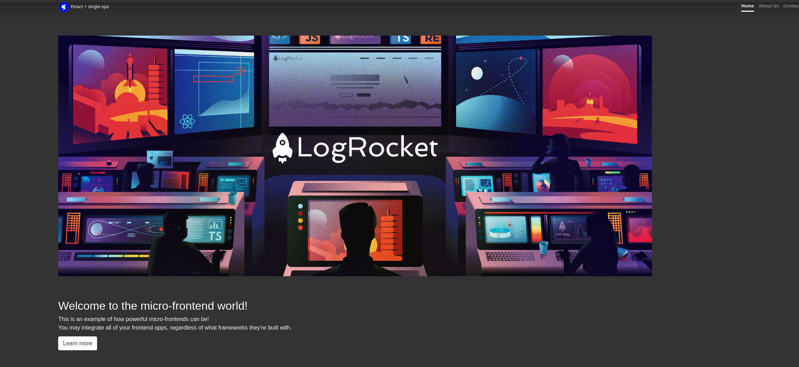

# poc-react-microfrontend
Prove of concept using react with SPA (Single Page Application) for microfrontend

# <b>Technologies Used on this POC</b> :rocket:

- Node JS:
  - Version: `>=14.X`
  - Download: https://nodejs.org/en/
- Single SPA:
  - Version: `>=5.X`
  - Download: https://single-spa.js.org/
- Jest:
  - Documentation: https://jestjs.io/docs/getting-started
  - Download: https://www.npmjs.com/package/jest
- Bootstrap:
  - Version: `>=4.X.X`: https://www.npmjs.com/package/jest
  - Documentation: https://getbootstrap.com/docs/4.6/getting-started/introduction/
- Bootstrap Cover Template:
  - Version: `>=4.X`: https://www.npmjs.com/package/jest
  - Template example: https://getbootstrap.com/docs/4.0/examples/cover/
- Webpack:
   - Version: `>=5.X`
   - Documentation: https://webpack.js.org/
<br>

# <b> About this Prove of Concept </b>
This POC is an example from <a href="https://blog.logrocket.com/micro-frontend-apps-single-spa/">LogRocket Blog</a>, using some of the functionality of microfrontends using the single-spa framework. Below we have the application routing and how to run the project locally to demonstrate microfrontend working.
<br>

## <b>Application Routing </b>
<hr>

In the ```application``` tag we have referenced the nomenclature of the ```name``` field of the ```package.json``` file, where the SPA uses to make the link and load the respective microfrontend in the informed path .

```html
<single-spa-router>
  <main>
    <route path="/">
      <application name="@AlexandreRocha/react-single-spa-navbar"></application>
    </route>
    <route path="/" exact="true">
      <application name="@AlexandreRocha/react-single-spa-home"></application>
    </route>
    <route path="/contact">
      <application name="@AlexandreRocha/react-single-spa-contact"></application>
    </route>
    <route path="/about">
      <application name="@AlexandreRocha/react-single-spa-about"></application>
    </route>
  </main>
</single-spa-router>
```

## <b>Microfrontends</b>
<hr>
<h3>This project has 5 micro frontends to demonstrate how its works and his  functionality. Below we have a simple table explaining what is each micro frontend and his speciality</h3>

- react-single-spa-root:
  - Main application responsible for routing and linking each microfrontend
  - Execution Port: 9000

- react-single-spa-navbar:
  - Application containing the project's navigation bar. The navigation bar is loaded on all micro frontends
  - Execution Port: 9001

- react-single-spa-home:
  - Application containing the project's home page on routing with prefix /
  - Execution Port: 9002

- react-single-spa-contact:
  - Application containing the project's contact's page on routing with exact path /contact
  - Execution Port: 9003

- react-single-spa-about:
  - Application containing the project's about us page on routing with exact path /about
  - Execution Port: 9004

## <b>How to run locally</b>
<hr>

To run this application locally make sure to run the command below on each project folder that contains the ```package.json```.

PS: Make sure you have the Node Package Manager (npm) installed on your machine.

```zsh
npm install --save
```
<hr>

After run the command above to install all dependencies for each microfrontend, run the command's below to execute each application separately.

PS: Each ```package.json``` has the script ```start``` with the command: ```webpack serve --port {9000, 9001, 9002, 9003 and 9004}```

```zsh
npm start
```

After following the steps above and run the application access the URL ```http://localhost:9000``` on your browser to see the microfrontend working.
<br>




